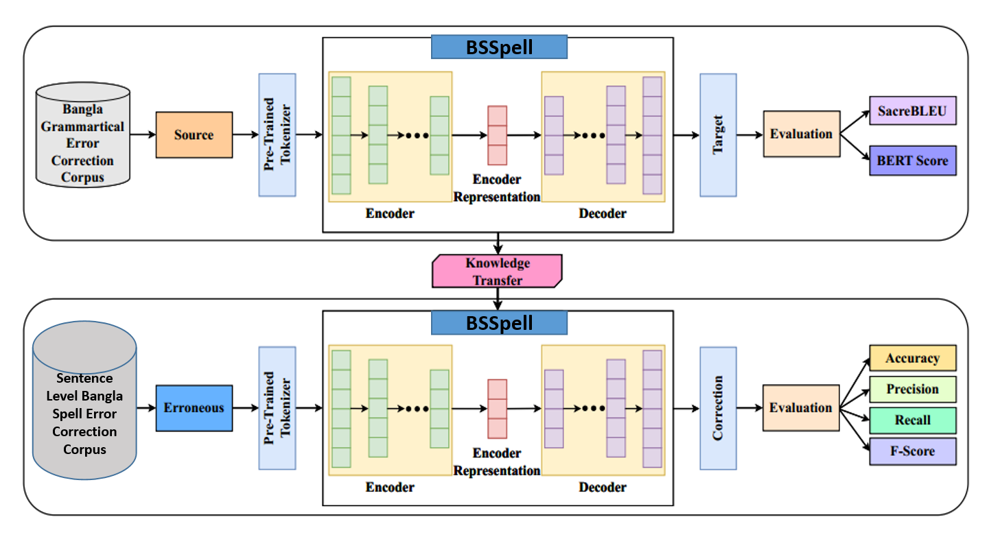

# BSSpell: A Monolingual Transformer-Based Sentence Level Spelling Error Correction Method for Bangla
A Monolingual Transformer-Based Sentence-Level Spelling Error Correction Model for Bangla

BSSpell is a sentence-level Bangla spelling correction model built on a Transformer-based encoder-decoder architecture, enhanced through **Knowledge Distillation** from a grammatical error correction task. It achieves **97.02% accuracy** on a custom 3.8M sentence corpus.

---



*Figure: BSSpell Architecture – Pretrained on BGEC, fine-tuned on BanglaSSECorpus.*

---

## 📘 Paper
> **Title**: BSSpell: A Monolingual Transformer-Based Sentence Level Spelling Error Correction Method for Bangla  
> **Authors**: Ajoy Dey, Muhammad Abdullah Adnan  
> **Affiliation**: Department of CSE, BUET  
> **Link**: [Coming soon]

---

## 📊 Results

| Model      | Accuracy | Precision | Recall | F1 Score |
|------------|----------|-----------|--------|----------|
| T5-Small   | 94.09%   | 94.5%     | 93.33% | 93.56%   |
| **BSSpell** | **97.02%** | 96.5%     | 98.7%  | 96.01%   |

| Dataset Size | Accuracy | F1 Score |
|--------------|----------|----------|
| 1.3M         | 92.09%   | 0.92     |
| 2.9M         | 94.09%   | 0.93     |
| **3.8M**         | **97.02%**   | 0.96     |

---

## 🛠️ Training Setup

- **Model Type**: Transformer (Encoder-Decoder)
- **Hidden Size**: 512
- **Feedforward Size**: 2048
- **Activation**: ReLU
- **Dropout**: 0.1
- **Optimizer**: AdamW
- **Learning Rate**: 5e-5
- **Loss**: Categorical Cross-Entropy
- **Epochs**: 50

---

## 📁 Dataset

**BanglaSSECorpus**  
- Size: ~3.8M sentence pairs  
- Origin: Synthetic error generation on BanglaParaphrase  
- Split: 80% Train / 10% Validation / 10% Test  
- Public Release: [Link coming soon]

---

## 🚀 Usage

```bash
# Clone this repository
git clone https://github.com/ajoydey00001/BSSpell.git
cd BSSpell

# Install requirements
pip install -r requirements.txt

# Train the model
python train.py --config configs/bsspell.yaml

# Evaluate the model
python evaluate.py --model checkpoints/bsspell_best.pt
